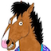
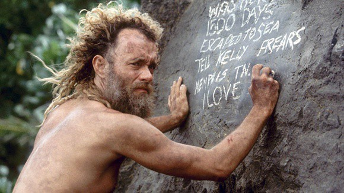
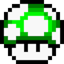
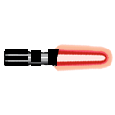
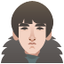
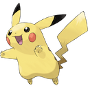
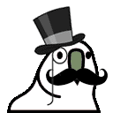
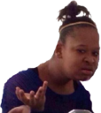
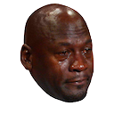

import emojis from './index.js';
import './style.css'

# Slackmojis

## Pop Culture

 

#### Super Mario

 

---

#### Star Wars

 

---

#### GOT

 

---

#### Pokemon

---

## Parrots

---

## Memes

 

---

## Sports

---

## Misc

